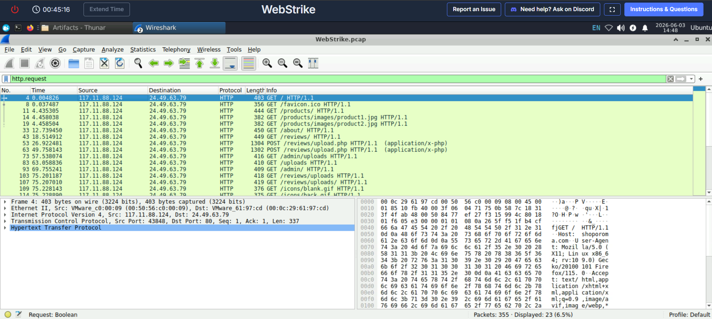
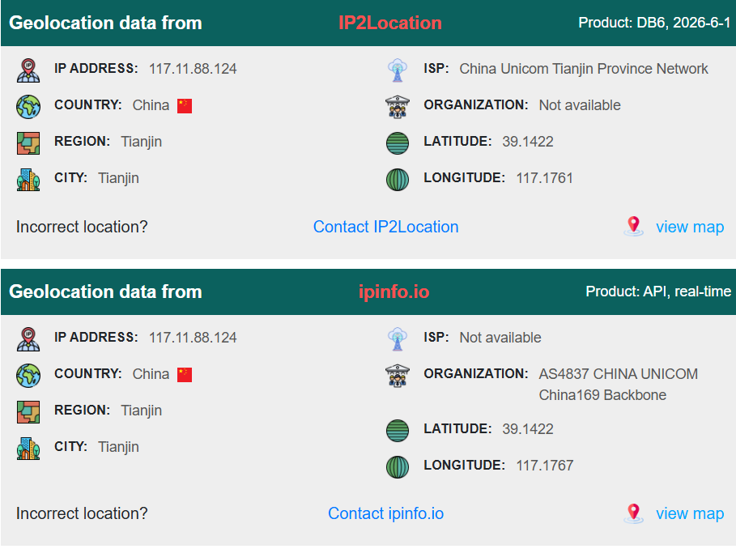
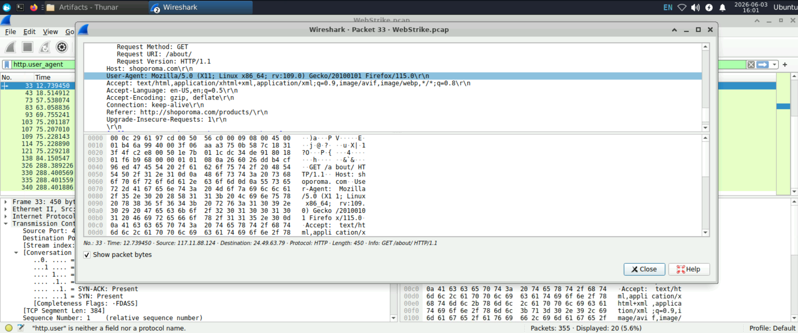
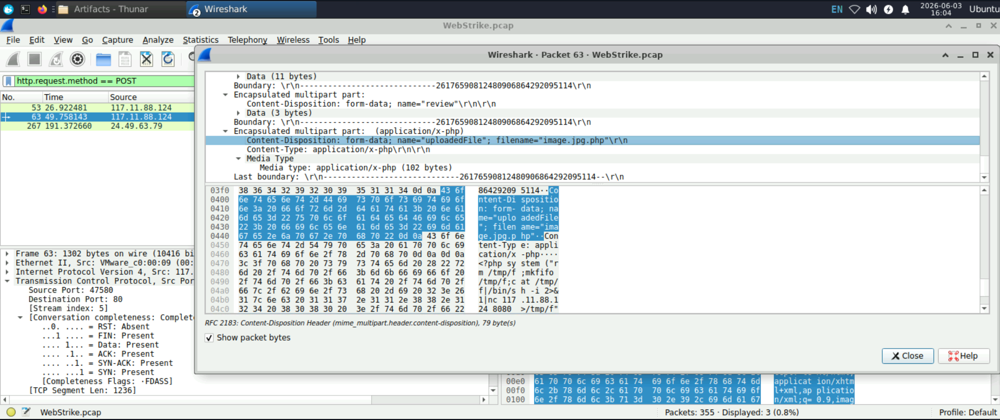
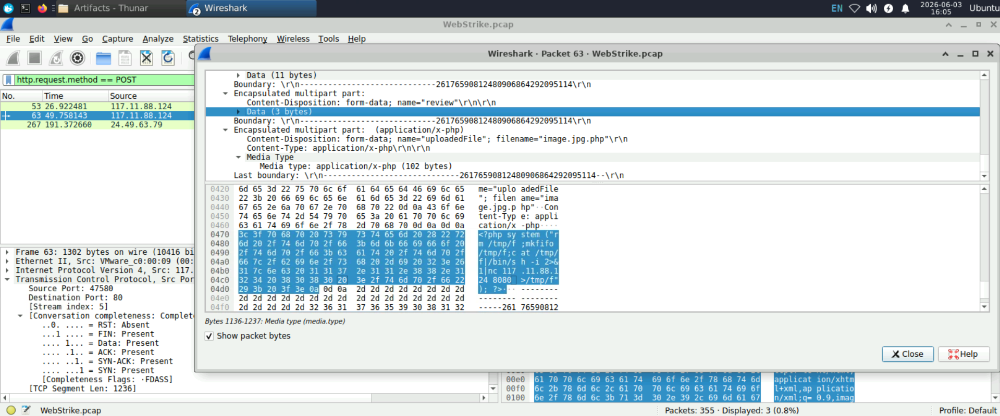
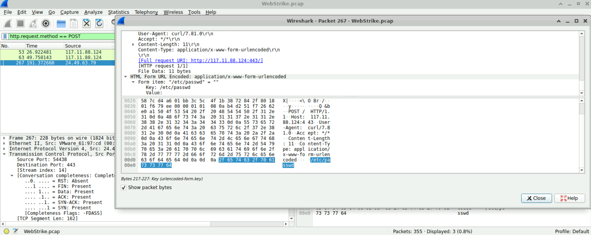

# WebStrike Writeup – Investigating a Web Shell Attack

## Introduction

In this lab, I investigated a packet capture (PCAP) from a suspected web server compromise. The objective was to analyze the network traffic, identify the attacker's actions, determine how the system was compromised, and understand what the attacker attempted to do after gaining access.

For this investigation, I used Wireshark to inspect HTTP traffic and reconstruct the attack timeline.

---

## Initial Traffic Analysis

I started by reviewing the HTTP traffic to understand how the attacker interacted with the web application.

While examining the requests, I identified a suspicious external IP address:

117.11.88.124

Using an IP geolocation service, I found that the IP address originated from Tianjin, China.

**Figure 1 – Attacker Source IP**
 

At this stage, I knew where the traffic was coming from, but I still needed to determine how the attacker gained access.

---

## Analyzing the User-Agent

Next, I inspected the HTTP User-Agent headers using Wireshark.

The following User-Agent string was observed:

Mozilla/5.0 (X11; Linux x86_64; rv:109.0) Gecko/20100101 Firefox/115.0

**Figure 2 – User-Agent Analysis**

This indicated that the attacker was using Firefox 115 on a Linux system.

Although User-Agent strings can be spoofed, they still provide useful context during an investigation.

---

## Discovering the Upload Functionality

To identify potentially malicious activity, I filtered for HTTP POST requests.

While reviewing the requests, I discovered traffic targeting the following endpoint:

/reviews/upload.php

**Figure 3 – Upload Request**

Since POST requests are commonly used for file uploads, this immediately caught my attention.

The request used multipart/form-data, which confirmed that files were being uploaded through the application.

---

## Identifying the Malicious Upload

After examining the upload request in greater detail, I found the file that had been uploaded by the attacker:

image.jpg.php

**Figure 4 – Malicious File Upload**

This filename stood out because it uses a double extension.

At first glance, the file appears to be an image due to the ".jpg" extension. However, because it ends with ".php", the server may interpret and execute it as a PHP script.

This is a common technique attackers use to bypass weak file upload validation controls.

At this point, it became clear that the attacker was attempting to upload a web shell.

---

## Reverse Shell Configuration

While investigating the uploaded shell, I found evidence that it attempted to establish communication with the attacker's machine using port:

8080

**Figure 6 – Reverse Shell Port**

This suggests that the attacker intended to establish a reverse shell connection, allowing them to remotely interact with the compromised server.

Reverse shells are commonly used by attackers because they provide a more interactive environment after gaining initial access.

---

## Attempted Access to Sensitive Files

As I continued examining the traffic, I noticed requests referencing the Linux passwd file.

The targeted file was:

passwd

which corresponds to:

/etc/passwd

**Figure 7 – Access to passwd File**

The passwd file contains information about local user accounts and is often one of the first files attackers attempt to access after compromising a Linux system.

This indicated that the attacker was performing system enumeration and gathering information about the environment.

---

## Attack Timeline

Based on the evidence collected, I reconstructed the following attack timeline:

1. The attacker connected to the web application.
2. The attacker discovered the file upload functionality.
3. A malicious PHP web shell named `image.jpg.php` was uploaded.
4. The uploaded web shell was executed successfully.
5. The attacker attempted to establish reverse-shell communication using port 8080.
6. The attacker accessed the passwd file to gather information about local users.

---

## Key Findings

| Finding             | Result              |
| ------------------- | ------------------- |
| Attacker IP         | 117.11.88.124       |
| Location            | Tianjin, China      |
| Browser             | Firefox 115         |
| Operating System    | Linux               |
| Vulnerable Endpoint | /reviews/upload.php |
| Uploaded File       | image.jpg.php       |
| Reverse Shell Port  | 8080                |
| Targeted File       | passwd              |

---

## Conclusion

This investigation revealed that the web application was vulnerable to malicious file uploads. The attacker exploited this weakness to upload a PHP web shell disguised as an image file using a double-extension technique.

After successfully executing the web shell, the attacker attempted to establish a reverse-shell connection and access sensitive system files for further reconnaissance.

This lab demonstrated how network traffic analysis can be used to reconstruct an attack, identify indicators of compromise, and understand the actions performed by an attacker after gaining access to a system.

